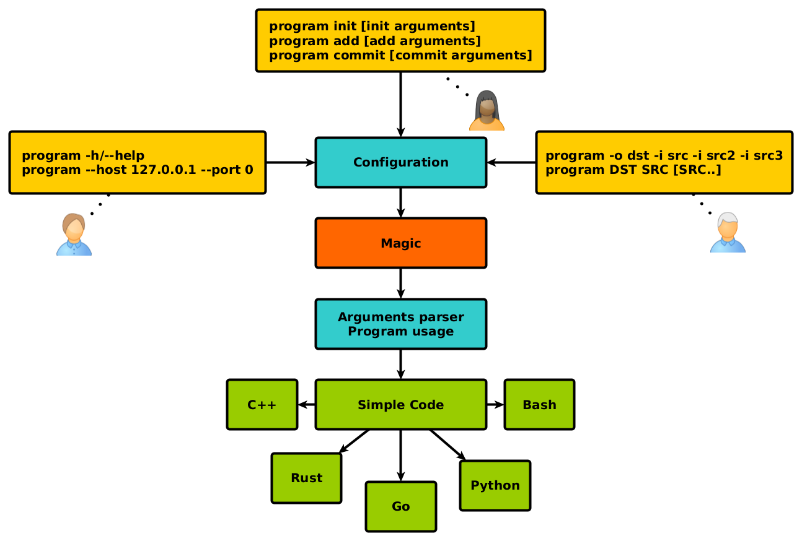

Intro
=====

Program usually starts from argument parsing, configuration file creation and configuration class, to store it in memory. It is not hard but time consuming work.

This project should make it easier and less time consuming to work with arguments. So the brand new project could be started faster, it allows easy parameters extension, so complex command branches may be as easy as change configuration. It should be simple to code as well.

This project, with time, may have new programming languages support, so you will not need to study multiple documentations, know just one - configuration creation rules.

So if you need flexible and easy way NOT to write argument parser and automate usage output, do want to rely on configuration rather than code - welcome, you are in the right spot.

Description
===========

**Protoargs** is python proto file transpiler, which generates arguments parser and configuration ready in-code structures using protobuf_ configuration.

The idea - you create *any_name_scheme.proto* file and then, using **protoargs** on the schema file, you will get generated arguments parser for the specific programming language. Currently **c++11** and **python** are supported.

First - checkout configuration construction rules below, and as a next step, go directly to specific manuals by clicking cppdoc_ or pythondoc_ for the in-code usage.

.. _protobuf: https://github.com/protocolbuffers/protobuf
.. _cppdoc: doc/cpp/
.. _pythondoc: doc/python/

Configuration File Rules
========================

The configuration is based on protobuf proto file version 2.

If you do not know what is **protobuf** project and **proto** configuration file, this is not show stopper, you may proceed without knowing it well. But if you are stuck with configuration please read about proto_ file creation.

.. _proto: https://developers.google.com/protocol-buffers/docs/proto

1. **Use proto file version 2 only**.

2. **package** directive is parsed and correct namespaces are used.

3. Message **protoargs** and **protoargs_links** are predefined and should not be used for purposes other than arguments parsing.

4. Other messages in the same proto file will be ignored.

5. Meaning of existing proto file directives using protoargs:

   + **optional** - argument may be missing within command line args, and is optional, you may specify default value for the parameter if missing. By default it will contain 0 for integers or empty string.
   + **required** - argument should be present, and is mandatory.
   + **repeated** - it may occur several times, all the values will be stored in array for you.

6. Types are limited to common type list:

   + **int32**
   + **uint32**
   + **int64**
   + **uint64**
   + **float**
   + **double**
   + **bool**
   + **string**

7. **Enums** are not supported.

8. Values specified in **upper case** will be transformed into **lower case** parameters.

9. Values containing **"_"** will be transformed into arguments containing **"-"** instead.

10. Custom default values may be specified for optional arguments. They will be shown during help message, as well as expected argument type.

11. Comments at the same line are treated as default value description ( SO if you want write in comment something nasty, write it above the line ).

12. Comments which are used for help description may not be multi-line.

message protoargs
=================

This is the main message, describing configuration class which will be filled with parsed arguments. **protoargs.py** script will search for this message name, and will fail if missing.

Let's start from simple one.

.. code:: proto

    syntax = "proto2";

    package bsw.protoargs.schema;

    // Main message, describing configuration class which will be filled with parsed arguments
    message protoargs
    {
        optional bool help = 1;                         // Show help message and exit,        it is transformed into --help long argument
        optional bool version = 2;                      // Show version message and exit,     it is transformed into --version long argument
        optional bool who_am_i = 3;                     // Show custom user message and exit, it is transformed into --who-am-i long argument
        optional uint p = 4 [default = 10];             // Integer param with default value,  it is transformed into -p short argument, even if not specified it will return with value 10
        optional uint32 param = 5 [default = 10];       // Integer param with default value,  it is transformed into --param short argument, even if not specified it will return with value 10
        optional string UPCASE = 6 [default = "Test"];  // Integer param with default value,  it is transformed into --upcase long argument, even if not specified it will return with value "Test"
    }//protoargs

..

This will automatically allows us parse specified arguments:

.. code:: bash

   ./program --help
   ./program --version
   ./program --who-am-i
   ./program -p 12 --param=11
   ./program -p 12 --param=11 --who_am_i

..

This is very nice for the start, but here is the problem: what if we want **-p** and **--param** arguments point to the same structure variable, because now they have separate and may carry different values, so currently we need to check both to decide the final value.

The other problem: what if we need some positional values, like:

.. code:: bash

   ./program SRC DST

..

For these purposes another message is prepared, called **protoargs_links**.

message protoargs_links
=======================

This is optional message, which is needed for advanced arguments parsing.

It describes which short and long parameters should be linked to protoargs configuration.
For all message fields, no matter if this is optional or required or repeated, directives are being **ignored**.
Field names from **protoargs_links** are now used as argument names for command line, and **protoargs** names will be used for in-code structure getters.
All fields should be **strings**, a must.
Default value is a **link** to configuration parameter inside **protoargs**, it **should be present** and **have exactly the same name**.

Now let's update our configuration, so that **-p** and  **--param** arguments will be bind to the same structure variable.

.. code:: proto

    syntax = "proto2";

    package bsw.protoargs.schema;

    // Main message, describing configuration class which will be filled with parsed arguments
    message protoargs
    {
        optional bool printHelp = 1;                       // Show help message and exit,        it is transformed into --help long argument
        optional bool printVersion = 2;                    // Show version message and exit,     it is transformed into --version long argument
        optional bool who_am_iVal = 3;                     // Show custom user message and exit, it is transformed into --who-am-i long argument
        optional uint32 paramVal = 4 [default = 10];       // Integer param with default value,  it is transformed into --param short argument, even if not specified it will return with value 10
        optional string UPCASEVAL = 5 [default = "Test"];  // Integer param with default value,  it is transformed into --upcase long argument, even if not specified it will return with value "Test"
    }//protoargs

    // Additional message, optional
    message protoargs_links
    {
        optional string help = 1 [default = "printHelp"];       // This comment will be ignored
        optional string version = 2 [default = "printVersion"]; // This comment will be ignored
        optional string who_am_i = 3 [default = "who_am_iVal"]; // This comment will be ignored
        optional string p = 4 [default = "paramVal"];           // This comment will be ignored
        optional string param = 5 [default = "paramVal"];       // This comment will be ignored
        optional string UPCASE = 6 [default = "UPCASEVAL"];     // This comment will be ignored
    }//protoargs

..

That's it. Now *paramVal* will be transformed into *paramval()* in-code method, but it will be filled when *-p NUM* or *--param=NUM* option specified. Field names inside **protoargs** message were changed to show you that now you can name them more verbose, and it will not influence actual command line argument names. So the command usage string will have exact the same names:

.. code:: bash

   ./program --help
   ./program --version
   ./program --who-am-i
   ./program -p 12 --param=11 # Note: this is not valid now, they can not be used both at the same time, use repeated instead of optional to achieve this
   ./program -p 12
   ./program --param=11

..

Positional arguments
====================

Suppose you need this kind of arguments to parse:

.. code:: bash

   ./program DST SRC [SRC..]

..

Where DST and SRC are not short/long parameters but defined rather by position. To make it more complex, let the user to specify SRC multiple times.

First thing to know about is - **positional** arguments are **always mandatory**, so even if you specify optional type, parser will generate code as if it was required type. Sure if positional argument could be optional, you could not rely on position anymore.

The other nice feature is having positional argument to be repeated multiple times, which is actually possible. This brings us to limitation, **there should be only one repeating positional argument, and it may be only at the end**.

Positional argument may be defined only using both **protoargs** and **protoargs_links** messages. All fields from **protoargs** message which are not linked inside **protoargs_links** are treated as **positional**. And their position inside **protoargs** message will be preserved as argument parsing, so place repeated positional arguments at the end of the **protoargs** message, if you do want make it working. Be warned that position number of the protobuf field is not parsed, so if you change the lines, you will break things, even if numbers are preserved, you need correct line order for now (for the example below, do not swap SRC and DST lines).

.. code:: proto

    syntax = "proto2";

    package bsw.protoargs.schema;

    // Main message, describing configuration class which will be filled with parsed arguments
    message protoargs
    {
        required string DST = 1;          // Positional argument
        repeated string SRC = 2;          // Positional repeating argument
    }//protoargs

    // Additional message, optional
    message protoargs_links
    {
    }//protoargs

..

**Note**: even if all your arguments are positional, you need empty **protoargs_links** message to be present in order for parser to understand your intentions. Other way you will get command line parser search for *--dst=STRING* and *--src=STRING* arguments.

Usage
=====

First of all, you are interested in one single file in this project, python script located in bin_ directory, called *protoargs.py*.

Now, when **protoargs** supports **python** arguments parser generation, protoargs script uses "dogfooding" model - uses self generated arguments parser for itself (see *protoargs.proto* inside bin_ directory).

So here is usage you will get with *-h/--help*.

.. _bin: src/Protoargs/bin/

.. code:: bash

    usage: python protoargs.py [-h] -i src -o dst [--loglevel loglevel] [--cpp] [--py]

    Protoargs program generates command line arguments parsers, using proto file
    as configuration.

    optional arguments:
      -h, --help           show this help message and exit
      -i src               Path to proto file with protoargs configuration
                           {REQUIRED,type:string,default:""}
      -o dst               Path to output directory, where parser will be placed.
                           {REQUIRED,type:string,default:""}
      --loglevel loglevel  Log level, default = INFO, possible values
                           [ERROR|WARNING|INFO|DEBUG]
                           {OPTIONAL,type:string,default:"INFO"}
      --cpp                Generate c++11 arguments parser (Note: you need
                           generate files with protoc compiler additionally, so
                           that parser will work). Parser will have name of proto
                           file name, e.g. [protoargs.proto]->[protoargs.pa.cc]
                           {OPTIONAL,type:bool,default:"false"}
      --py                 Generate python arguments parser. Parser will have name
                           of proto file name, e.g.
                           [protoargs.proto]->[protoargs_pa.py]
                           {OPTIONAL,type:bool,default:"false"}

..

Just to test, you may get exact the same protoargs parser generated by running command below.
And you should get *protoargs_pa.py* file inside */tmp* directory.

.. code:: bash

    python ./protoargs.py -i protoargs.proto -o /tmp --py

..

Now go directly to specific manuals by clicking cppdoc_ or pythondoc_ for the in-code usage.

Help
====

The script was never perfect, author avoids multiple edge cases, what does not make it usable for everyone. So it will be just great to receive feedbacks, features, bug reports and fixes. Thanks people.

I may be not so fast with changes, sorry for that.
