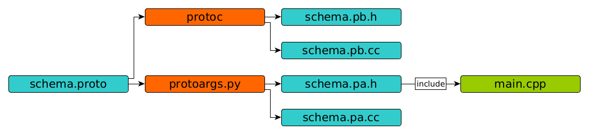

Description
===========

**Protoargs** is python proto file transpiler, which generates arguments parser and configuration ready c++11 in-code structures using protobuf_ and cxxopts_.

This documentation part shows c++ parser generation and usage based on existing configuration. Start from main_ page for better description and proto file configuration rules.

.. _protobuf: https://github.com/protocolbuffers/protobuf

.. _cxxopts: https://github.com/jarro2783/cxxopts

.. _main: https://github.com/ashlander/protoargs/tree/master

If you need storing configuration file with args, you may use Protoconf_ to make your life easier.

**PROS**:

+ Creates c++ configuration class with all setters and getters for all fields based on schema.
+ Creates c++ args parsing using cxxopts
+ This is protobuf, you get ready to send configuration directly via network, or update it same way from remote host (no, network implementation you should find on your own).
+ Simplifies creation even complex commands like 'command subcommand [subcommand_args]'
+ Protoconf_ compatibility

.. _Protoconf: https://github.com/ashlander/protoconf

**CONS**:

- Tested and used on Linux only (be my guest to try it out on other OS, and I will gladly remove this line)
- Dependencies, not standalone (protobuf_ + cxxopts_)

Usage
=====

First of all, you are interested in one single file in this project, python script located in bin_ directory.

.. _bin: ../../src/Protoargs/bin/

.. code:: bash

   python protoargs.py -o <out DIR> -i PROTOFILE --cpp
               out DIR         [mandatory] path to output directory
               PROTOFILE       [mandatory] path to proto file

..

Also you need files generated from the same proto file using **protoc** compiler. These files will contain structure for arguments values.

.. code:: bash

   protoc -I=SRC_DIR --cpp_out=DST_DIR SRC_DIR/PROTOFILE

..

You should get 4 files as result: **.pa.cc**, **.pa.h**, **pb.cc**, **pb.h**. Attach them to your project and now you are ready to move forward. Do not forget installed dependencies like **protobuf** and **cxxopts**.

Example of Usage Output
=======================

Suppose we have such a proto file (do not be afraid, this is just to show you possible output).

.. code:: proto

    syntax = "proto2";
    
    package bsw.protoargs.schema;
    
    message dummy // this message is present but will be ignored
    {
        optional string param1 = 1 [default = "default"]; // String param option with default value
        optional uint32 param2 = 2 [default = 10];        // Integer param with default value
        optional int32 param3 = 3;                        // Integer param without default value
        optional float param4 = 4;                        // Float param without default value
    }
    
    // Main message, describing configuration class which will be filled with parsed arguments
    message protoargs
    {
        optional string paramA = 1 [default = "// tricky default value"];      // String param option with default value. Note: this comment will be taken as description
        optional uint32 paramB = 2 [default = 10];        // Integer param with default value
        optional int32 paramC = 3;                        // Integer param without default value. Avoid new lines they are rendered not correctly in help. Words will be transfered to new line anyway
        optional float paramD = 4;                        // Float param without default value
        required string paramE = 5;                       // String param which should be anyway
        repeated int32 paramF = 6;                        // Integer param which may encounter multiple times
        required uint64 PARAMG = 7;                       // Positional integer param, positional param is always \"required\"
        required bool P_A_R_A_M_G_2 = 8;                  // Positional boolean param, positional param is always \"required\", Note: param set - true, missing - false
        optional bool param_I = 9 [default = true];       // Boolean arg with default value (despite it is declared after positional args, that is not a problem)
        optional bool param_J = 10;                       // Boolean arg without default value
        repeated string PARAMH = 11;                      // Positional repeating string params, there may be only one repeating positional param
        optional bool printHelp = 12;                     // Print help and exit
    }//protoargs
    
    // Additional message, optional
    message protoargs_links
    {
        optional string a_long_param = 1 [default = "paramA"];
        optional string a = 2 [default = "paramA"];
        optional string b_long_param = 3 [default = "paramB"];
        optional string c = 4 [default = "paramC"];
        optional string c_long_param = 5 [default = "paramC"];
        optional string d_long_param = 6 [default = "paramD"];
        optional string e = 7 [default = "paramE"];
        optional string f = 8 [default = "paramF"];
        optional string i = 9 [default = "param_I"];
        optional string j_long = 10 [default = "param_J"];
        optional string h = 11 [default = "printHelp"];
        optional string help = 12 [default = "printHelp"];
    }//protoargs

..

Your application usage output

.. code:: plain

    program [OPTION...] PARAMG P_A_R_A_M_G_2 PARAMH [PARAMH...]
   
    -a, --a-long-param [paramA]  String param option with default value. Note:
                                 this comment will be taken as description
                                 {OPTIONAL,type:string,default:'// tricky default
                                 value'}
   
        --b-long-param [paramB]  Integer param with default value
                                 {OPTIONAL,type:uint32,default:'10'}
   
    -c, --c-long-param [paramC]  Integer param without default value. Avoid new
                                 lines they are rendered not correctly in help.
                                 Words will be transfered to new line anyway
                                 {OPTIONAL,type:int32,default:''}
   
        --d-long-param [paramD]  Float param without default value
                                 {OPTIONAL,type:float,default:''}
   
    -e, [paramE]                 String param which should be anyway
                                 {REQUIRED,type:string}
   
    -f, [paramF]                 Integer param which may encounter multiple
                                 times {REPEATED,type:int32,default:''}
   
    -i,                          Boolean arg with default value (despite it is
                                 declared after positional args, that is not a
                                 problem) {OPTIONAL,type:bool,default:'true'}
   
        --j-long                 Boolean arg without default value
                                 {OPTIONAL,type:bool,default:''}
   
    -h, --help                   Print help and exit
                                 {OPTIONAL,type:bool,default:''}
   
                PARAMG           Positional integer param, positional param is
                                 always "required" {REQUIRED,type:uint64}
   
                P-A-R-A-M-G-2    Positional boolean param, positional param is
                                 always "required", Note: param set - true,
                                 missing - false {REQUIRED,type:bool}
   
                PARAMH           Positional repeating string params, there may
                                 be only one repeating positional param
                                 {REQUIRED,type:string}
   
..

Simple Example
==============

Let's take our first simple example (as a reminder *-p NUM* and *--param=NUM* arguments are different and will be stored in different values):

.. code:: proto

    syntax = "proto2";

    package bsw.protoargs.schema;

    // Main message, describing configuration class which will be filled with parsed arguments
    message protoargs
    {
        optional bool help = 1;                         // Show help message and exit,        it is transformed into --help long argument
        optional bool version = 2;                      // Show version message and exit,     it is transformed into --version long argument
        optional bool who_am_i = 3;                     // Show custom user message and exit, it is transformed into --who-am-i long argument
        optional uint p = 4 [default = 10];             // Integer param with default value,  it is transformed into -p short argument, even if not specified it will return with value 10
        optional uint32 param = 5 [default = 10];       // Integer param with default value,  it is transformed into --param short argument, even if not specified it will return with value 10
        optional string UPCASE = 6 [default = "Test"];  // Integer param with default value,  it is transformed into --upcase long argument, even if not specified it will return with value "Test"
    }//protoargs

..

Now what you need from 4 generated files is the one with **.pa.h** file, it contains interface you need. It will look like **class ProtoArgs** protected with specified namespaces **bsw.protoargs.schema**. Inside you will find main access methods:

.. code:: c++

    /**
     * @brief Get program usage
     * @param program Program name for usage description
     * @return Usage string
     */
    virtual std::string usage(const std::string& program) const;

    /**
     * @brief Parse arguments and get object with configuration
     * @param program Program name for usage description
     * @param argc    Command line args num
     * @param argv[]  Command line args
     * @param allowIncomplete  Fills valid configuration fields with no errors, ignoring requires
     * @return Configuration or nullptr if failed
     */
    virtual protoargs* parse(const std::string& program, int argc, char* argv[], bool allowIncomplete = false) const;

..

They are quite clear, **usage** outputs help message, and the **parse** parses arguments. Both accept program name which you want to see in help, as long as **parse** method may call **usage** internally if something goes wrong.

**allowIncomplete** option if set to true, will return all successfully parsed arguments ignoring failed ones, other way null will be returned. This option is useful if tested for --help/--version arguments when having required arguments as well. It will return configuration and not null saying required argument missing. The idea is to test twice, at first with **allowIncomplete** and check for --help/--version, and next check without, making it do full check. Still even with **allowIncomplete** it may output errors anyway if wrong arguments specified.

**Note**: configuration returned is created with **new** and should be destroyed afterwards. It is highly recommended to use **unique_ptr** or **shared_ptr** to ease your life.

Let's go for code:

.. code:: c++

    simple::ProtoArgs arguments;
    auto config = std::unique_ptr<simple::protoargs>( arguments.parse(argv[0], argc, (char**)argv) );
    if (!config)
    {
       // you do not need usage output, it is already on the screen
       return EXIT_FAILURE;
    }

    if (argc == 1 || config->has_help()) // if no argument or --help specified print help end exit
    {
       std::cout << arguments.usage(argv[0]);
       return EXIT_SUCCESS;
    }

    if (config->has_version()) // if version specified
    {
       std::cout << "Some version";
       return EXIT_SUCCESS;
    }

    if (config->has_param())
    {
       std::cout << "Param = " << config->param();
    }

    ...
..

Well that should be simple enough to start your going.

Advanced Usage
==============

In case this all is not how you would like it, and e.g. **usage** method output does not satisfy you. You may start doing it all by yourself. Fist of all - you can redefine **usage** method, it is virtual and all you need is override and change it. You may loose flexibility unfortunately if schema will change.

The other method is to get **cxxopts** internals with **prepareOptions** method. From now on read cxxopts_ documentation on how to proceed.

.. code:: c++

    /**
     * @brief In case you want add something, or change
     * e.g. set your own usage output
     * look into cxxopts documentation
     * Note: you should parse it manually from now on
     * @param program Program name for usage description
     * @return Options
     */
    virtual cxxopts::Options prepareOptions(const std::string& program) const;
 
..

Complex Example
===============

Here comes something big. Current implementations allows us to make complex parsing easily. Like

.. code:: bash

   program --help
   program create --help
   program create [create arguments]

..

The idea behind it is a little bit tricky, but it is working well enough.

So first of all you need 2 *.proto* files with own command settings, plain **program** and **program create**.

Here is main proto:

.. code:: plain

   syntax = "proto2";

   package bsw.protoargs.main;

   message protoargs
   {
       optional bool help = 1 [default = false];         // Print help and exit
       required string COMMAND = 2;                      // Command (create, copy, etc)
   }//protoargs

   message protoargs_links
   {
       optional string h = 11 [default = "help"];
       optional string help = 12 [default = "help"];
   }//protoargs

..

**Note**: Each of 2 proto files will be source for generated files, each generated set will have **class ProtoArgs** which will have name conflict, so change **package** directive, so that each command setting will be protected with own namespace.

So here we do expect no or single argument for main program. This limitation gives us advantage.

Let's go for the rest proto files

.. code:: plain

    syntax = "proto2";

    package bsw.protoargs.main.create;

    message protoargs
    {
        optional bool help = 1 [default = false];         // Print help and exit
        optional uint64 size = 2 [default = 0];           // Size of the file
        required string PATH = 3;                         // Path to file to create
    }//protoargs

    message protoargs_links
    {
        optional string h = 1 [default = "help"];
        optional string help = 2 [default = "help"];
        optional string s = 3 [default = "size"];
        optional string size = 4 [default = "size"];
    }//protoargs

..

After generating all 8 files, let's think about these command parsing:

.. code:: bash

   program --help
   program create --help

..

For the first iteration we need to parse with main program parser. But it is created to parse the first and not the second. It will fail on **program create --help**. So as far as we have limited us to 2 options we may parse first 2 options only.

We still will be using **allowIncomplete** when parsing, to avoid error message saying *required parameter command is missing*, when searching for -h/--help.

.. code:: c++

    main::ProtoArgs arguments;

    // first time parse withh allowIncomplete to avoid missing required argument error
    auto config = std::unique_ptr<main::protoargs>( arguments.parse(program, argc < 2 ? argc : 2 /*need only 2 args to detect command*/, (char**)argv, true /*allow incomplete*/) );

    if (!config)
    {
       // you do not need usage output, it is already on the screen
       return EXIT_FAILURE;
    }

    if (argc == 1 || config->has_help()) // if no argument or --help specified print help end exit
    {
       std::cout << arguments.usage(program);
       return EXIT_SUCCESS;
    }

    // second time parse is full check parsing, so we do need this command
    config = std::unique_ptr<main::protoargs>( arguments.parse(program, argc < 2 ? argc : 2 /*need only 2 args to detect command*/, (char**)argv);

    if (!config)
    {
       // you do not need usage output, it is already on the screen
       return EXIT_FAILURE;
    }

    if (config->has_command && config->command() == "create")
    {
       ...
    }

    ...

..

Ok, we have discovered command, now that's time to parse. The only problem here is that we have positional argument (which is command) standing not at the end, so we can't create proper schema to parse. But as long as we found proper command we do not need it any more, so how about removing. So meet **exclude** method, which updates incoming arguments by removing some of them.

.. code:: c++

    /**
     * @brief Filter result, Note: argv will be destroyed on object destruction
     */
    struct ExcludeResult
    {
        ~ExcludeResult() { delete [] argv; }
        int argc;
        char** argv;
    };//struct

    /**
     * @brief Helper function, filter arguments by positions sequence
     * This is useful if you need support multy-commands, like "git add [add args]" and "git commit [commit args]"
     * So at some point you need to remove "add" ot "commit" command argument
     * @param argc Original argc
     * @param argv Original argv
     * @param exclude Array of positions to exclude
     * @return Result with updated argc argv
     */
    virtual ExcludeResult exclude(int argc, char** argv, std::set<int> exclude) const

..

Now continue parsing our **create** command:

.. code:: c++

    ...

    if (config->has_command && config->command() == "create")
    {
         auto helpProgram = program + " " + command;

         main::create::ProtoArgs createArguments;

         auto filtered = createArguments.exclude(argc, (char**)argv, { 2 }); // remove 2nd position with command

         // first parsing - ignoring required parameters
         auto createConfig = std::unique_ptr<main::create::protoargs>( createArguments.parse(helpProgram, filtered.argc, filtered.argv, true /*allow incomplete*/) );

         if (!createConfig)
         {
            // you do not need usage output, it is already on the screen
            return EXIT_FAILURE;
         }

         if (filtered.argc == 1 || createConfig->has_help()) // if no argument or --help specified print help end exit
         {
            std::cout << createArguments.usage(helpProgram);
            return EXIT_SUCCESS;
         }

         // second full parsing with full check
         createConfig = std::unique_ptr<main::create::protoargs>( createArguments.parse(helpProgram, filtered.argc, filtered.argv) );

         if (!createConfig)
         {
            // you do not need usage output, it is already on the screen
            return EXIT_FAILURE;
         }

         // rest values discovery
         ...
    }

    ...

..

Extreme Usage
=============

Sometimes people need some real complex argument parsing, like

.. code:: bash

   program [program options] command [command options]

..

Well, I have not tested it this way, but you may achieve it. The trick is you need to calculate number of *[program options]* manually. This way you can exclude needed number of arguments, and proceed as previous example.

Building Tests
==============

Proceed to Tests_.

.. _Tests: ../../src/Tests/

